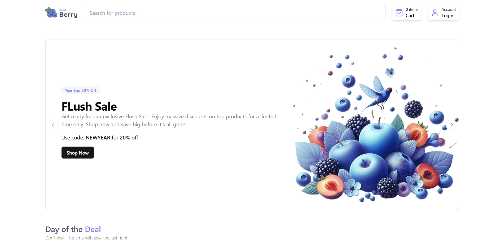

# Cartify - Modern E-Commerce Platform

[](https://cartify-swart.vercel.app)
[](https://github.com/KMV531/cartify)

🚀 **A full-featured e-commerce solution** built with Next.js and modern web technologies. Features product management, secure checkout, and CMS integration.



## ✨ Key Features

- **Complete Shopping Experience**: Product browsing, search, cart, and checkout
- **Sanity CMS Integration**: Easy product/content management
- **Stripe Payments**: Secure payment processing
- **Responsive Design**: Mobile-first approach
- **Type-Safe**: Built with TypeScript
- **Authentication**: Full user authentication system with clerk

## 🛠️ Tech Stack

| Technology       | Purpose                          |
|------------------|----------------------------------|
| Next.js 14       | React framework & SSR            |
| Tailwind CSS     | Modern styling utility           |
| Sanity CMS       | Product/content management       |
| shadcn/ui        | Accessible UI components         |
| Stripe           | Payment processing               |
| TypeScript       | Type-safe development            |

## 🚀 Performance Highlights

- **Fast Loading**: Optimized images and code splitting
- **SEO Ready**: Next.js optimized for search engines
- **Secure**: Sanitized inputs and protected routes

## 🌟 Why This Stands Out
**This isn't just another e-commerce template:**

- **Real-world functionality with Stripe integration**

- **Content management via Sanity CMS**

- **Production-ready architecture**

## 🤝 Available for Freelance Work

**I specialize in building:**

- **High-performance sites**

- **Custom CMS solutions**

- **Secure payment integrations**

📩 **Contact**: koladjamomo@gmail.com <br /> <br />
🔗 **Portfolio**: [kmvdev.vercel.app](http://kmvdev.vercel.app)

**Deployed on Vercel**: http://cartify-swart.vercel.app

## 💻 Local Setup

1. Clone repository:
   ```bash
   git clone https://github.com/yourusername/cartify.git
   
2. Install dependencies:
   ```bash
   npm install

3. Set up environment variables (create .env.local):
   ```bash
   NEXT_PUBLIC_SANITY_PROJECT_ID=your_project_id
   NEXT_PUBLIC_SANITY_DATASET=your_public_sanity_dataset
   SANITY_API_TOKEN=your_sanity_write_token
   SANITY_API_READ_TOKEN=your_your_sanity_read_token
   STRIPE_SECRET_KEY=your_stripe_key
   STRIPE_WEBHOOK_SECRET=your_stripe_webhook_secret
   NEXT_PUBLIC_CLERK_PUBLISHABLE_KEY=your_clerk_pushiable_key
   CLERK_SECRET_KEY=your_clerk_secret_key

4. Run development server:
   ```bash
   npm run dev
